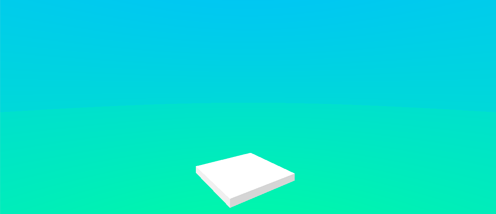

# Procedural Skybox

A simple skybox shader that lerps between two colors with a few fancy settings.

Great for cartoony, stylized games.

# Method

Besides the simple lerp and a few variables to adjust the lerp to one color or the other,
there is an horizon line float. 

Pixels above the horizon line lerp normally, pixels below allow you to adjust the color
to lerp faster or slower (yielding a nice horizon line).

# Example

## Simple two color skybox with a white cube

